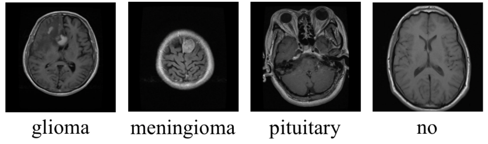
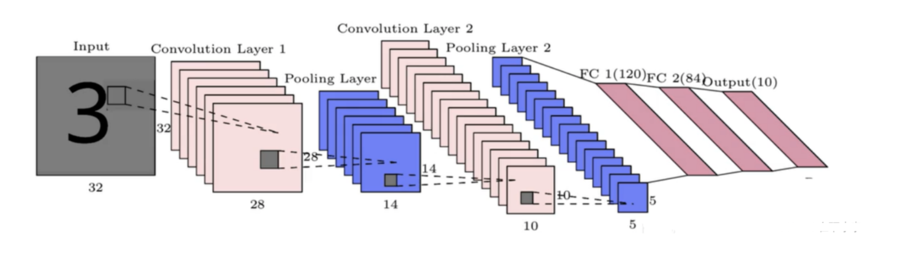
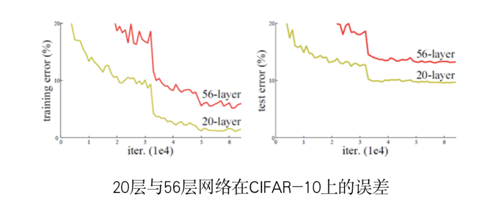
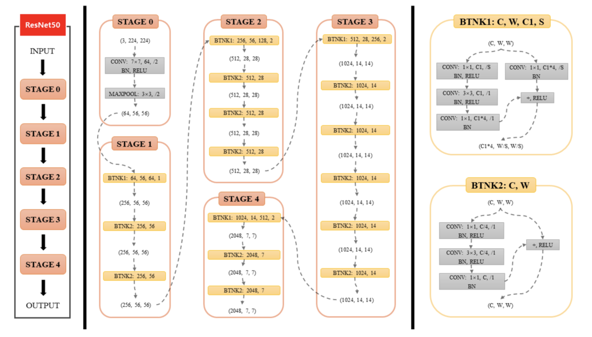

#### 一、项目背景

本实践任务目标是对人脑的脑瘤进行分类，数据集分为no_tumor（无肿瘤）、glioma_tumor（胶质瘤）、meningioma_tumor（脑膜瘤）、pituitary_tumor（垂体瘤）四类，范例图片如下。

本项目用到的数据集链接: https://pan.baidu.com/s/1xWLEAfx4yepcurakRneG7g 提取码: kmk8

#### 二、算法原理介绍

随着深度学习的快速发展，越来越多的研究者尝试将深度学习技术引入到肿瘤的检测项目中，在此，我们主要介绍其中的卷积神经网络以及深度残差网络。

##### 1、关于卷积神经网络

卷积神经网络（CNN）是一种深度学习模型或类似于人工神经网络的多层感知器，常用来分析视觉图像。其在图像识别中达到了前所未有的准确度，有着广泛的应用。主要结构包括输入层、卷积层、池化层以及全连接层，模型结构如下图所示。

- 为什么要卷积

   如果没有卷积层，最终会得到大量需要训练的参数，而且大多数人都没有解决计算成本高昂任务的能力。此外，由于卷积神经网络具有的参数会更少，因此就可以避免出现过拟合现象。

- 为什么要池化？

    池化层的核心目标之一是提供空间方差，这意味着CNN将能够识别对象的相应特征，即使它的外观以某种方式发生改变（例如出现噪点或人为的少量扰动），也就是说CNN受单一特征的影响较小。

##### 2.深度残差网络（ResNet）

 深度残差网络的提出是CNN图像史上的一件里程碑事件。ResNet刷新了CNN模型在ImageNet上的历史。

 **关于神经网络的退化问题：**

假如你有一个浅层网络，你想通过向上堆积新层来建立深层网络。网络深度增加时，网络准确度出现饱和，甚至出现下降。这个现象就是退化问题（Degradation problem）。 网络越来越深，深层的层越来越难以学习到浅层特征图中的特征，导致网络精度降低。

**残差学习：**

残差学习能解决退化问题，对于一个堆积层结构（几层堆积而成）当输入为 x 时其学习到的特征记为 H(x) ，现在我们希望其可以学习到残差 F(x) = H(x) - x ，这样其实原始的学习特征是 F(x) + x 当残差为0时，此时堆积层仅仅做了恒等映射，至少网络性能不会下降，实际上残差不会为0，这也会使得堆积层在输入特征基础上学习到新的特征，从而拥有更好的性能。

#### 三、总结

读者可基于上述给到的baseline模型做进一步的改进和完善，主要有两个大方向，一是做数据增强，二是对现有模型进行进一步的改进。上述链接给到的原始数据集中的训练集图片仅2800多张，而且无脑瘤和各类脑瘤的训练集数量有明显的区别；并且各类脑瘤对于非专业的医学人士也很难分辨出来，任务本身难度很高。所以可以基于扩充无肿瘤的数据集以及采用较大规模的数据集这两点思想，对数据集进行增强，以期获得更好的效果。
