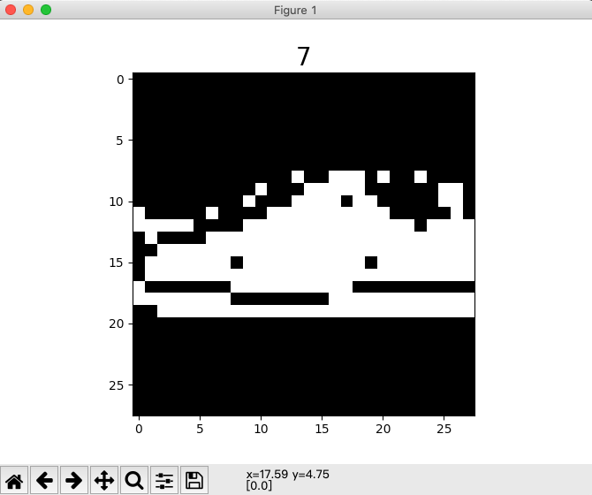

# Fashion MNIST Classification with CNN based on MindSpore

> 基于MindSpore 实现CNN网络FashionMnist图像分类

本文主要内容：

- 数据准备
- 模型构建
- 模型训练
- 模型验证

## 1. 数据准备

### 1.1 数据简介

`Fashion-MNIST`是一个替代[MNIST手写数字集](http://yann.lecun.com/exdb/mnist/)的图像数据集。 它是由Zalando（一家德国的时尚科技公司）旗下的[研究部门](https://research.zalando.com/)提供。其涵盖了来自10种类别的共7万个不同商品的正面图片。Fashion-MNIST的大小、格式和训练集/测试集划分与原始的MNIST完全一致。60000/10000的训练测试数据划分，28x28的灰度图片。你可以直接用它来测试你的机器学习和深度学习算法性能，且**不需要**改动任何的代码。

这个数据集的样子大致如下（每个类别占三行）：


### 1.2 下载数据

> 数据官方仓库为https://github.com/zalandoresearch/fashion-mnist，但是下载速度较慢。
>
> 这里从gitee备份镜像下载，地址为https://gitee.com/mirrors/Fashion-MNIST。

克隆数据仓库

```shell
git clone https://gitee.com/mirrors/Fashion-MNIST.git
```

创建数据目录

```shell
mkdir data && cd data
```

复制数据

```shell
cp ../Fashion-MNIST/data/fashion/* ./
```

校验数据

```shell
md5sum *
```

> 校验结果如下所示
>
> ```shell
> bef4ecab320f06d8554ea6380940ec79  t10k-images-idx3-ubyte.gz
> bb300cfdad3c16e7a12a480ee83cd310  t10k-labels-idx1-ubyte.gz
> 8d4fb7e6c68d591d4c3dfef9ec88bf0d  train-images-idx3-ubyte.gz
> 25c81989df183df01b3e8a0aad5dffbe  train-labels-idx1-ubyte.gz
> ```

### 1.3 解压数据

解压缩`gz`数据

```shell
gunzip *
```

校验解压后数据

```shell
md5sum *
```

> 校验结果如下所示
>
> ```shell
> 8181f5470baa50b63fa0f6fddb340f0a  t10k-images-idx3-ubyte
> 15d484375f8d13e6eb1aabb0c3f46965  t10k-labels-idx1-ubyte
> f4a8712d7a061bf5bd6d2ca38dc4d50a  train-images-idx3-ubyte
> 9018921c3c673c538a1fc5bad174d6f9  train-labels-idx1-ubyte
> ```

最终数据目录结构如下：

```shell
data/
├── t10k-images-idx3-ubyte
├── t10k-labels-idx1-ubyte
├── train-images-idx3-ubyte
└── train-labels-idx1-ubyte
```

### 1.4 初探数据

使用如下代码，可以可视化查看部分数据集。

```python
import matplotlib.pyplot as plt
import mindspore.dataset as ds


if __name__ == "__main__":
    fashion_mnist_dataset_dir = "./data/"
    fashion_mnist_dataset = ds.FashionMnistDataset(dataset_dir=fashion_mnist_dataset_dir, num_samples=3)
    fashion_mnist_it = fashion_mnist_dataset.create_dict_iterator()
    data = next(fashion_mnist_it)

    plt.imshow(data['image'].asnumpy().reshape(28, 28), cmap='gray')
    plt.title(data['label'].asnumpy(), fontsize=20)
    plt.show()
```

下图为标签7运动鞋（Sneaker）样本的可视化图片。



### 1.5 数据处理

> 本来笔者想实现mindrecord版本的fashion-minst读取，结果发现官方已经做了支持。
>
> 所以这里借用官方的接口和相关数据处理方法。

代码和所需要的引入的包库如下所示。

```python
import mindspore.dataset as ds
import mindspore.dataset.transforms.c_transforms as C
import mindspore.dataset.vision.c_transforms as CV
from mindspore.dataset.vision import Inter
from mindspore import dtype as mstype


def create_dataset(data_path, usage="train", batch_size=32, repeat_size=1, num_parallel_workers=1):
    # 定义数据集
    fashion_mnist_ds = ds.FashionMnistDataset(data_path, usage=usage)
    resize_height, resize_width = 28, 28
    rescale = 1.0 / 255.0
    shift = 0.0
    rescale_nml = 1 / 0.3081
    shift_nml = -1 * 0.1307 / 0.3081

    # 定义所需要操作的map映射
    resize_op = CV.Resize((resize_height, resize_width), interpolation=Inter.LINEAR)
    rescale_nml_op = CV.Rescale(rescale_nml, shift_nml)
    rescale_op = CV.Rescale(rescale, shift)
    hwc2chw_op = CV.HWC2CHW()
    type_cast_op = C.TypeCast(mstype.int32)

    # 使用map映射函数，将数据操作应用到数据集
    fashion_mnist_ds = fashion_mnist_ds.map(
        operations=type_cast_op, input_columns="label", num_parallel_workers=num_parallel_workers)
    fashion_mnist_ds = fashion_mnist_ds.map(
        operations=[resize_op, rescale_op, rescale_nml_op, hwc2chw_op],
        input_columns="image", num_parallel_workers=num_parallel_workers)

    # 进行shuffle、batch、repeat操作
    buffer_size = 10000
    fashion_mnist_ds = fashion_mnist_ds.shuffle(buffer_size=buffer_size)
    fashion_mnist_ds = fashion_mnist_ds.batch(batch_size, drop_remainder=True)
    fashion_mnist_ds = fashion_mnist_ds.repeat(count=repeat_size)

    return fashion_mnist_ds
```

## 2. 模型构建

这里在官方Mnist教程中`LeNet5`网络的基础上做适当修改。具体代码如下所示。

```python
import mindspore.nn as nn
from mindspore.common.initializer import Normal


class LeNet5(nn.Cell):
    """
    Lenet网络结构
    """
    def __init__(self, num_class=10, num_channel=1):
        super(LeNet5, self).__init__()
        # 定义所需要的运算
        self.conv1 = nn.Conv2d(num_channel, 6, 5, pad_mode='valid')
        self.conv2 = nn.Conv2d(6, 16, 5, pad_mode='valid')
        self.fc1 = nn.Dense(16 * 4 * 4, 256, weight_init=Normal(0.02))
        self.fc2 = nn.Dense(256, 128, weight_init=Normal(0.02))
        self.fc3 = nn.Dense(128, num_class, weight_init=Normal(0.02))
        self.relu = nn.ReLU()
        self.max_pool2d = nn.MaxPool2d(kernel_size=2, stride=2)
        self.flatten = nn.Flatten()

    def construct(self, x):
        # 使用定义好的运算构建前向网络
        x = self.conv1(x)
        x = self.relu(x)
        x = self.max_pool2d(x)
        x = self.conv2(x)
        x = self.relu(x)
        x = self.max_pool2d(x)
        x = self.flatten(x)
        x = self.fc1(x)
        x = self.relu(x)
        x = self.fc2(x)
        x = self.relu(x)
        x = self.fc3(x)
        return x
```

## 3. 模型训练

模型训练主要是为了找到理想的网络参数，需要定义损失函数和优化器。相应部分的代码如下所示。

```python
# 实例化网络
net = LeNet5()
# 定义损失函数
net_loss = nn.SoftmaxCrossEntropyWithLogits(sparse=True, reduction='mean')
# 定义优化器
net_opt = nn.Momentum(net.trainable_params(), learning_rate=0.01, momentum=0.9)
```

训练后的模型需要保存下载，进行下一步模型验证或Fine-tune微调相关工作。模型保存部分的代码如下所示。

```python
# 设置模型保存参数
config_ck = CheckpointConfig(save_checkpoint_steps=100, keep_checkpoint_max=10)
# 应用模型保存参数
ckpt_cb = ModelCheckpoint(prefix="lenet_ckpt", config=config_ck)
```

通过MindSpore提供的`model.train`接口可以方便地进行网络的训练，`LossMonitor`可以监控训练过程中`loss`值的变化。

```python
def train_net(model, epoch_size, data_path, batch_size, repeat_size, ckpt_cb, sink_mode):
    """定义训练的方法"""
    # 加载训练数据集
    ds_train = create_dataset(data_path, usage="train", batch_size=batch_size, repeat_size=repeat_size)
    model.train(epoch_size, ds_train, callbacks=[ckpt_cb, LossMonitor(125)], dataset_sink_mode=sink_mode)
```

通过模型运行测试数据集得到的结果，验证模型的泛化能力。

```python
def test_net(model, data_path):
    """定义验证的方法"""
    ds_eval = create_dataset(data_path, usage="test")
    acc = model.eval(ds_eval, dataset_sink_mode=False)
    print("acc: {}".format(acc), flush=True)
```

以上代码为拆分开的代码，整体运行代码见`main.py`文件。可使用如下命令训练模型：

```shell
python3 main.py --data_path=./data --device_target=CPU
```

训练过程中会打印loss值，类似下图。loss值会波动，但总体来说loss值会逐步减小，精度逐步提高。每个人运行的loss值有一定随机性，不一定完全相同。 训练过程中loss打印示例如下：

```shell
epoch: 1 step: 125, loss is 2.295269250869751
epoch: 1 step: 250, loss is 2.3060524463653564
epoch: 1 step: 375, loss is 1.4239269495010376
epoch: 1 step: 500, loss is 0.6873521208763123
epoch: 1 step: 625, loss is 0.8742141723632812
......
epoch: 5 step: 1375, loss is 0.5237604975700378
epoch: 5 step: 1500, loss is 0.242930606007576
epoch: 5 step: 1625, loss is 0.37006133794784546
epoch: 5 step: 1750, loss is 0.46649742126464844
epoch: 5 step: 1875, loss is 0.1670462042093277
acc: {'Accuracy': 0.8619791666666666}
```

可以在打印信息中看出模型精度数据，示例中精度数据达到86.2%，模型质量良好。随着网络迭代次数`train_epoch`增加，模型精度会进一步提高。

读者也可以尝试使用不同的网络结构来优化模型，以提高模型精度。

## 4. 模型验证

使用如下代码加载训练的模型，并对单个图片数据进行分类预测。

```python
import numpy as np

from mindspore import load_checkpoint, load_param_into_net

from mindspore import Model
from mindspore import Tensor

# create_dataset definition
# LeNet5 definition

def predict():
    net = LeNet5()

    # 加载已经保存的用于测试的模型
    param_dict = load_checkpoint("lenet_ckpt-5_1875.ckpt")
    # 加载参数到网络中
    load_param_into_net(net, param_dict)

    # 定义测试数据集，batch_size设置为1，则取出一张图片
    fashion_minst_path = "./data"
    ds_test = create_dataset(data_path=fashion_minst_path, usage="test", batch_size=1).create_dict_iterator()
  
    for i in range(1000):
        data = next(ds_test)

    data = next(ds_test)
    # images为测试图片，labels为测试图片的实际分类
    images = data["image"].asnumpy()
    labels = data["label"].asnumpy()

    model = Model(net)
    # 使用函数model.predict预测image对应分类
    output = model.predict(Tensor(data['image']))
    predicted = np.argmax(output.asnumpy(), axis=1)

    # 输出预测分类与实际分类
    print(f'Predicted: "{predicted[0]}", Actual: "{labels[0]}"')


if __name__ == "__main__":
    predict()
```

示例输出如下内容：

```shell
Predicted: "5", Actual: "5"
```
